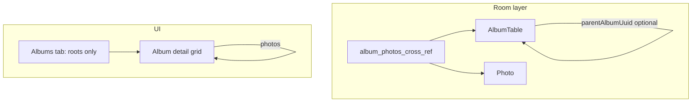

# Hierarchical albums + scoped favorites

## Terminology and baseline

- Photok’s “folders” are **albums**: Room entity [`AlbumTable`](app/src/main/java/dev/leonlatsch/photok/model/database/entity/AlbumTable.kt), DAO [`AlbumDao`](app/src/main/java/dev/leonlatsch/photok/model/database/dao/AlbumDao.kt), domain [`AlbumRepository`](app/src/main/java/dev/leonlatsch/photok/gallery/albums/domain/AlbumRepository.kt).
- There is **no** `AppDatabase.kt`; the Room database is [`PhotokDatabase.kt`](app/src/main/java/dev/leonlatsch/photok/model/database/PhotokDatabase.kt) (currently `DATABASE_VERSION = 5`). Your requested `parentFolderId: Long?` does not align with album PKs (String UUIDs). The plan uses **`parentAlbumUuid: String?`** (nullable FK-style reference to `album.album_uuid`), which matches the rest of the schema.

## 1. Schema and destructive migration

- **`AlbumTable`**: Add `parentAlbumUuid: String?` with `@ColumnInfo(index = true)`. Optional `@ForeignKey` to `AlbumTable` with `onDelete = NO_ACTION` (deletion is handled in code).
- **`Photo`**: Add `isFavorite: Boolean = false` with `@ColumnInfo(defaultValue = "0")` and a `COL_IS_FAVORITE` constant (for queries). Use `var` if you use `@Query` UPDATE, or keep immutable `Photo` and update via `@Query("UPDATE photo SET ...")`.
- **[`PhotokDatabase.kt`](app/src/main/java/dev/leonlatsch/photok/model/database/PhotokDatabase.kt)**: Bump `DATABASE_VERSION` to **6**. For this dev phase, **do not** add `AutoMigration(5, 6)`; rely on destructive rebuild.
- **[`AppModule.kt`](app/src/main/java/dev/leonlatsch/photok/di/AppModule.kt)** (`Room.databaseBuilder` chain): Add **`.fallbackToDestructiveMigration()`** (and optionally `.fallbackToDestructiveMigrationOnDowngrade(true)`). This avoids crash-on-launch when the on-disk schema is older than v6.

## 2. Album DAO / repository: children, recursive delete, move (DB only)

- **`AlbumDao`**
  - Queries: `observeChildAlbums(parentUuid: String)`, `getChildAlbums`, `getAlbumsWithParent` (or load all and filter in repo if you prefer one query).
  - **Recursive delete (transaction)**:
    - Resolve **descendants** (BFS/DFS in Kotlin using loaded rows, or a single `getAllAlbums()` map).
    - **Order**: delete **deepest children first**, then walk up to the root being deleted (so parent rows disappear after children).
    - For each album UUID in that order: `removeAllPhotosFromAlbum(uuid)` then `delete` row (existing pattern from [`unlinkAndDeleteAlbum`](app/src/main/java/dev/leonlatsch/photok/model/database/dao/AlbumDao.kt)).
    - **No changes** to encrypted file paths or blob layout; only `album` rows and `album_photos_cross_ref` rows (already true today for non-permanent delete).
  - **`moveAlbum(albumUuid, newParentUuid: String?)`**: `UPDATE album SET parent_album_uuid = :newParent WHERE album_uuid = :album` plus **cycle check** in repository (descendant cannot become ancestor). Does not touch disk.

- **`AlbumRepository` / [`AlbumRepositoryImpl`](app/src/main/java/dev/leonlatsch/photok/gallery/albums/data/AlbumRepositoryImpl.kt)**
  - Replace single-album `unlinkAndDeleteAlbum` usage with a new **`deleteAlbumTree(album, permanentlyDeleteFiles: Boolean)`**:
    - Before removing refs, collect distinct `photo_uuid` values linked to **any album in the subtree** (query cross-ref by `album_uuid IN (...)`).
    - Perform recursive **DB** deletion as above.
    - If `permanentlyDeleteFiles`: for each collected photo, after subtree cleanup, if the photo **has no remaining** `album_photos_cross_ref` rows, call [`PhotoRepository.safeDeletePhoto`](app/src/main/java/dev/leonlatsch/photok/model/repositories/PhotoRepository.kt) (removes DB row + encrypted files). This avoids deleting blobs for photos still linked outside the deleted tree.
  - **`createAlbum`**: Accept optional `parentAlbumUuid` (domain [`Album`](app/src/main/java/dev/leonlatsch/photok/gallery/albums/domain/model/Album.kt) + [`Mappers.kt`](app/src/main/java/dev/leonlatsch/photok/gallery/albums/Mappers.kt) must thread the field through `toData`/`toDomain`).
  - **`observeAllAlbumsWithPhotos`**: Only include **root** albums (`parentAlbumUuid == null`) so the albums tab stays a tree root list.

## 3. Photo DAO / repository: favorites

- **`PhotoDao`**: `@Query("UPDATE photo SET isFavorite = :favorite WHERE photo_uuid = :uuid")` (and mirror column name you choose). Optionally `observe` variants that append `AND isFavorite = 1` for gallery.
- **`PhotoRepository`**: `suspend fun setFavorite(uuid: String, favorite: Boolean)` delegating to DAO.
- **Constructors**: Every `Photo(...)` creation (e.g. import in [`PhotoRepository.safeImportPhoto`](app/src/main/java/dev/leonlatsch/photok/model/repositories/PhotoRepository.kt)) must pass default `isFavorite = false`.

## 4. Album photo queries: direct photos vs favorites scope

- **Direct photos in current album** (unchanged semantics): Keep existing `INNER JOIN ... WHERE ref.album_uuid = ?` for normal grid and sort ([`createSortedPhotosQuery`](app/src/main/java/dev/leonlatsch/photok/model/database/dao/AlbumDao.kt)).
- **Favorites scoped to folder + descendants**: Add a parameterized query (or `SupportSQLiteQuery`) where:
  - `ref.album_uuid IN (:subtreeAlbumUuids)` with `subtreeAlbumUuids = self + all descendants` computed in repository.
  - `AND p.isFavorite = 1`
  - Same `ORDER BY` as existing sort (reuse `sort.field.columnName` / `sort.order.sql`; for `LinkedAt`, keep joining on `ref` as today).

- **Main gallery** (`albumUuid == null` in [`ImageViewerViewModel.createPhotosFlow`](app/src/main/java/dev/leonlatsch/photok/imageviewer/ui/ImageViewerViewModel.kt)): When favorites filter on, use `PhotoDao` query / `observeAll` variant with `WHERE isFavorite = 1`.

## 5. UI: album detail — subfolders + back + delete dialog

- **[`AlbumDetailUiState`](app/src/main/java/dev/leonlatsch/photok/gallery/albums/detail/ui/AlbumDetailUiState.kt)**: Add `childAlbums: List<AlbumItem>` (reuse [`AlbumItem`](app/src/main/java/dev/leonlatsch/photok/gallery/albums/ui/compose/AlbumsContent.kt) / [`AlbumTile`](app/src/main/java/dev/leonlatsch/photok/gallery/components/AlbumsGrid.kt) pattern).
- **[`AlbumDetailViewModel`](app/src/main/java/dev/leonlatsch/photok/gallery/albums/detail/ui/AlbumDetailViewModel.kt)**: `combine` album photos flow with child albums flow (from repository). Map children with existing `toUi()` logic for counts/covers.
- **[`PhotoGallery`](app/src/main/java/dev/leonlatsch/photok/gallery/components/PhotoGallery.kt) / `PhotoGrid`**: Extend to accept optional `folderTiles: List<AlbumItem>` and `onOpenFolder: (String) -> Unit`. Render **folder tiles first** in the same `LazyVerticalGrid`, then photo items (keys: album id vs photo uuid). Tapping a folder uses **existing global navigation** — same as [`AlbumsNavigator`](app/src/main/java/dev/leonlatsch/photok/gallery/albums/ui/navigation/AlbumsNavigator.kt) / `actionGlobalAlbumDetailFragment(albumUuid)`.
- **Back**: [`AlbumDetailScreen`](app/src/main/java/dev/leonlatsch/photok/gallery/albums/detail/ui/compose/AlbumDetailScreen.kt) already uses `navController.navigateUp()`; no change needed once child screens are the same `albumDetailFragment` with a different argument.
- **Create subfolder**: From album detail overflow menu, open a small dialog (reuse pattern from [`CreateAlbumDialog`](app/src/main/java/dev/leonlatsch/photok/gallery/albums/ui/compose/CreateAlbumDialog.kt)) that calls `createAlbum` with `parentAlbumUuid = currentAlbum`.
- **Delete confirmation**: Replace the simple [`ConfirmationDialog`](app/src/main/java/dev/leonlatsch/photok/ui/components/ConfirmationDialog.kt) with a dedicated composable (or extended dialog) that shows:
  - Text: **"Delete this folder and everything inside?"** (new string resource).
  - **Checkbox**: “Permanently delete encrypted files from disk” (new string).
  - Confirm passes `permanentDelete` into `AlbumDetailUiEvent.DeleteAlbum(permanent = …)` → repository `deleteAlbumTree`.

## 6. UI: favorites filter + viewer star

- **Gallery** ([`GalleryViewModel`](app/src/main/java/dev/leonlatsch/photok/gallery/ui/GalleryViewModel.kt), [`GalleryScreen`](app/src/main/java/dev/leonlatsch/photok/gallery/ui/compose/GalleryScreen.kt) / top bar): Add a **“View favorites”** toggle (e.g. `IconButton` next to sort). State combines with `photosFlow` so the grid shows only `isFavorite` photos at root.
- **Album detail**: Same toggle; when on, use the **scoped album query** (self + descendants) described above. **Sort menu** continues to use the same `Sort` object; only the SQL `WHERE` changes.
- **Fullscreen viewer**: Add `ImageViewerUiEvent.ToggleFavorite` and wire in [`ImageViewerControls.kt`](app/src/main/java/dev/leonlatsch/photok/imageviewer/ui/compose/ImageViewerControls.kt) — **Filled** vs **Outlined** star:
  - Add Gradle dependency **`androidx.compose.material:material-icons-extended`** (Compose BOM) and use `Icons.Filled.Star` / `Icons.Outlined.Star` (if you strictly want the “stars” glyph, use `Icons.Filled.Stars` / `Icons.Outlined.Stars` — your call; default recommendation is **Star** for a single-item favorite).
- **Viewer list consistency**: Add optional nav arg `favorites_only` (boolean) to [`main_nav_graph.xml`](app/src/main/res/navigation/main_nav_graph.xml) `imageViewerFragment`, thread through [`PhotoAction.OpenPhoto`](app/src/main/java/dev/leonlatsch/photok/gallery/ui/navigation/PhotoActionsNavigator.kt) / [`ImageViewerFragment`](app/src/main/java/dev/leonlatsch/photok/imageviewer/ui/ImageViewerFragment.kt) / `ImageViewerViewModel` factory so **swiping** in the viewer matches the filtered list (same SQL as the grid).

## 7. Backup / misc

- If backup uses Gson on `Photo` / albums, ensure new fields are included or defaulted on restore ([`RestoreBackupV3/V4`](app/src/main/java/dev/leonlatsch/photok/backup/domain/) etc.) — at minimum default `isFavorite = false` and `parentAlbumUuid = null` when missing.

## Risk / scope notes

- **Move folder** is specified as DB-only (`parentAlbumUuid`); implement `moveAlbum` when you add a move UI — not required for subfolder navigation + delete.
- **Permanent delete** semantics above intentionally **skip** photos that remain linked to albums outside the deleted subtree.
